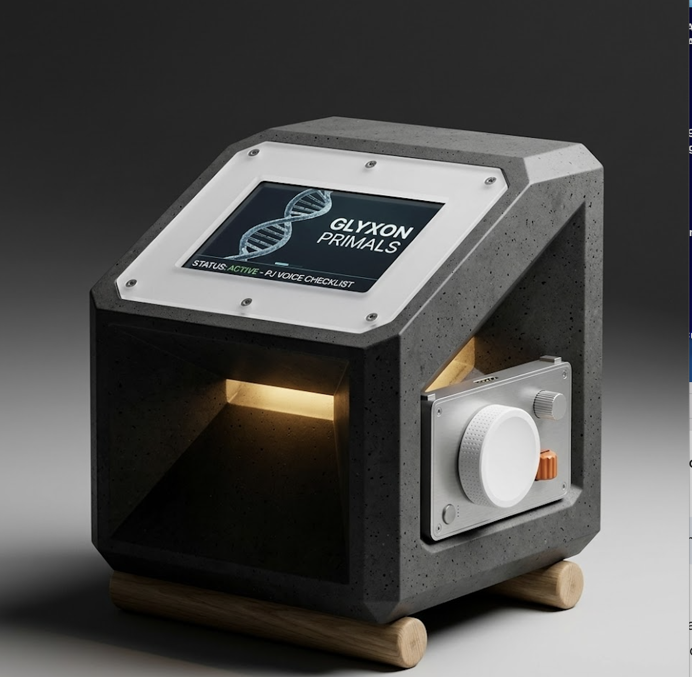
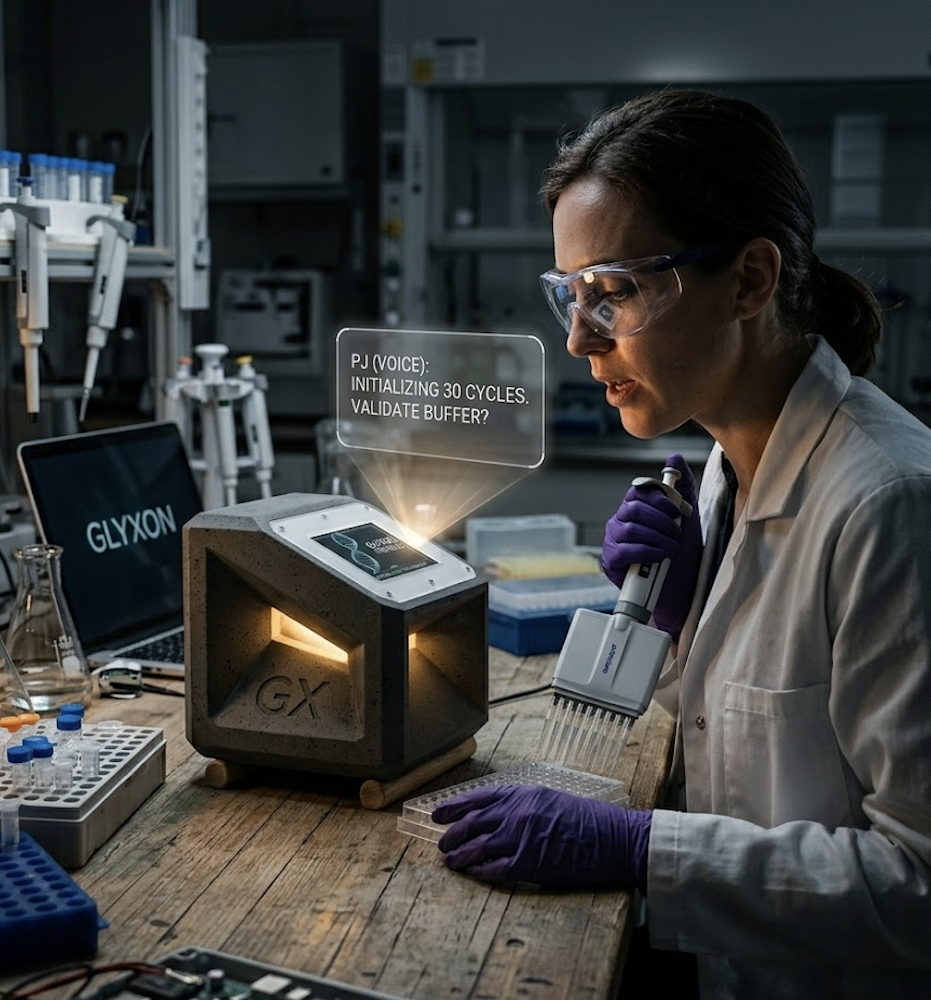

# 🏛️ GLYXON PRIMALS: The Brutalist qPCR Infrastructure
> **"Scientific sovereignty is not built; it is claimed. In concrete we trust. With PJ we amplify."**

A project developed by the **Synthetic BioSystems Lab** at **Glyxon Biolabs** ([www.glyxon.com](http://www.glyxon.com)).

---

## 👁️ The Vision: Molecular Sovereignty
The current biotechnology landscape is gated by proprietary hardware, closed clouds, and fragile supply chains. **Glyxon Biolabs** is reclaiming the means of molecular production.

**GLYXON PRIMALS** is our first stand: a high-fidelity DNA amplification platform built to withstand the collapse of centralized infrastructure, integrated with the open-source intelligence of **PJ (Personal Justice)**.

*Caption: The PRIMALS Bunker. Monolithic micro-concrete chassis with integrated precision controls and Matter-ready architecture. Designed at the Synthetic BioSystems Lab.*

---

## 🤖 Meet PJ (Personal Justice): The Conversational Lab Interface
The lab is a hands-free environment. Traditional interfaces fail when the user is wearing contaminated gloves or managing complex protocols. **Personal Justice (PJ)** is the local-first intelligence that bridges the gap.

### Hands-Free Sovereignty
PJ operates entirely on your local network (via **Home Assistant** and **Matter**), ensuring that your experimental data and voice commands never leave the "Bunker".

*Caption: "PJ, initialize 30 cycles." Real-time protocol validation and hands-free management in a high-fidelity research environment.*

---

## 🧱 The Core Pillars

### 1. Brutalist Hardware (The Bunker)
Developed under the philosophy of **Frugal Science**, we abandoned plastic injected molding for **Ultra-High Performance Concrete (UHPC)** and precision-machined metals.

* **Thermal Mass:** Exceptional passive stability for delicate fluorescence readings.
* **Resilience:** Fireproof, chemical-resistant, and aesthetically eternal.
* **Precision Interaction:** Featuring high-fidelity dimpled dials and an angled UI for optimal ergonomics.

### 2. Photonic Ramping (The 36 Matrix)
We replaced the standard Peltier block with a custom **36 Infrared LED Matrix** controlled by an ESP32-S3.

* **Speed:** Rapid energy delivery directly to the micro-centrifuge tubes.
* **Open Hardware:** Fully repairable and upgradable with off-the-shelf components.

### 3. Open Home / Matter Ready
PRIMALS is the flagship instrument for the **Open Home** ecosystem in biotechnology. It speaks a universal language, allowing for seamless integration with local servers without proprietary apps.

---

## 🛠 Project Roadmap & Status

| Phase | Description | Key Components | Status |
| :--- | :--- | :--- | :--- |
| **0: Infrastructure** | Chassis & Mold Design | UHPC Mix, Silicone Mold, CAD | **Complete** |
| **1: Photonic** | IR LED Matrix Control | ESP32-S3 PWM, Thermistors, PID | **Active Dev** |
| **2: Intelligence** | PJ Voice Integration | Wyoming Protocol, Home Assistant | **Active Dev** |
| **3: Open Biology** | Protocol Standardization | Open-source polymerases (Taqchyon) | **Research** |

---

### "PJ, initialize the cycle. Let's decode the future."
Developed by **David J. Castillo** at **Synthetic BioSystems Lab** *(c) 2026 Glyxon Biolabs - [www.glyxon.com](http://www.glyxon.com)*

## 🛠️ How to Learn with PRIMALS: The Montessori Protocol

If you are here to build, do not fear the complexity. This laboratory is designed for experimentation through failure. 

1. **Touch the Hardware:** Don't just read the code. Print the rPET supports, feel the texture of the UHPC concrete. The weight of the bunker is your first lesson in thermal stability.
2. **Break the Cycle:** If your PID oscillates or your fluorescence readings are noisy, **good**. That is the machine teaching you about infrared interference and heat capacity.
3. **Calibrate by Doing:** Use the 160° lens to see the world through the bunker's eyes. If the alignment is off, adjust the 0.22cm mirrors. 
4. **Questions Later:** Build first. Follow the `BUILD.md` (coming soon). The theory in `REFERENCES.md` will make sense only once you've seen the green glow of a successful amplification.

> "In this lab, we don't follow protocols; we inhabit them."
